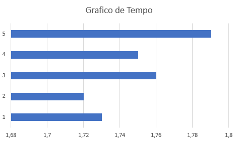
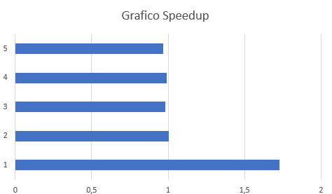
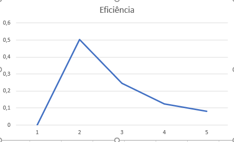

# Relatório da Prática de Multiprocessamento

**Disciplina:** Programação Concorrente e Distribuída  
**Aluno(s):** Oliver Henrique Ferreira de Jesus  
**Professor:** Rafael Marconi  
**Data:** 18/03/2026  

---

## 1. Descrição do Problema

O problema consiste em realizar a leitura de um arquivo de texto de grande porte contendo milhões de números e realizar a soma de todos os seus valores, avaliando o impacto no tempo de execução ao variar a quantidade de processos dedicados à tarefa.

* **Objetivo do programa:** Somar uma base gigante de números lidos de um arquivo `.txt`, dividindo o processamento matemático entre múltiplos núcleos da CPU para verificar se ocorre redução no tempo total de execução.
* **Volume de dados:** Arquivo `numero2.txt` contendo grande volume de linhas com dados numéricos.
* **Algoritmo utilizado:** Padrão "Delegação em Lotes" (Chunking) com Pool de Trabalhadores (Worker Pool). Uma thread principal realiza a leitura sequencial do arquivo e agrupa as linhas em blocos de 100.000 unidades. Cada bloco é enviado de forma assíncrona (`apply_async`) para um processo trabalhador independente, que realiza a conversão de string para float e calcula a soma parcial. Por fim, a thread principal soma os resultados parciais.
* **Complexidade:** A complexidade de tempo é aproximadamente O(N), onde N é o número de linhas do arquivo. A divisão em p processos tenta transformar o custo de processamento para O(N/p), embora a complexidade de I/O permaneça O(N).

---

## 2. Ambiente Experimental

| Item                        | Descrição |
| --------------------------- | --------- |
| Processador                 | Intel Core i5 12500 |
| Número de núcleos           | 6 núcleos físicos / 12 lógicos] |
| Memória RAM                 | 16 GB DDR4] |
| Sistema Operacional         | Windows 11] |
| Linguagem utilizada         | Python 3 |
| Biblioteca de paralelização | `multiprocessing` (nativa do Python) |
| Compilador / Versão         | Interpretador CPython [Ex: Versão 3.10.x] |

---

## 3. Metodologia de Testes

Os testes avaliaram o desempenho computacional escalando o número de processos trabalhadores utilizando a biblioteca `multiprocessing`.

* **Medição de Tempo:** O tempo foi cronometrado via código utilizando a função `time.time()` da biblioteca nativa `time`.
* **Execuções e Entradas:** O programa foi testado utilizando uma única massa de dados (o arquivo `numero2.txt`). 
* **Configurações e Procedimento:** Os testes foram realizados alterando a entrada da quantidade de processos (1, 2, 4, 8 e 12). Os tempos coletados são reflexo destas rodadas.

---

## 4. Resultados Experimentais

| Nº Threads/Processos | Tempo de Execução (s) |
| -------------------- | --------------------- |
| 1                    |  1,73                 |
| 2                    |  1,72                 |
| 4                    |  1,76                 |
| 8                    |  1,75                 |
| 12                   |  1,79                 |

---

## 5. Cálculo de Speedup e Eficiência

Para a formulação, **T(1) = 1,73s**.

* **Speedup P=2:** 1,73 / 1,72 = 1,0058 | **Eficiência P=2:** 1,0058 / 2 = 0,5029
* **Speedup P=4:** 1,73 / 1,76 = 0,9829 | **Eficiência P=4:** 0,9829 / 4 = 0,2457
* **Speedup P=8:** 1,73 / 1,75 = 0,9885 | **Eficiência P=8:** 0,9885 / 8 = 0,1235
* **Speedup P=12:** 1,73 / 1,79 = 0,9664 | **Eficiência P=12:** 0,9664 / 12 = 0,0805

---

## 6. Tabela de Resultados

| Threads/Processos | Tempo (s) | Speedup | Eficiência |
| ----------------- | --------- | ------- | ---------- |
| 1                 | 1.73      | 1.00    | 1.00       |
| 2                 | 1.72      | 1.01    | 0.50       |
| 4                 | 1.76      | 0.98    | 0.25       |
| 8                 | 1.75      | 0.99    | 0.12       |
| 12                | 1.79      | 0.97    | 0.08       |

---

## 7. Gráfico de Tempo de Execução

---

## 8. Gráfico de Speedup

---

## 9. Gráfico de Eficiência

---

## 10. Análise dos Resultados

* **O speedup obtido foi próximo do ideal?** Não. O speedup real estagnou em torno de 1.0, distanciando-se completamente do cenário ideal de ganho linear.
* **A aplicação apresentou escalabilidade?** Não. Aumentar o número de processos não reduziu o tempo da tarefa. Para 4, 8 e 12 processos, o tempo foi ligeiramente pior do que a execução serial.
* **Em qual ponto a eficiência começou a cair?** A eficiência caiu drasticamente logo ao adotar o 2º processo (caindo para 50%), beirando a zero com 12 processos (8%).
* **Houve overhead de paralelização?** Sim. O gargalo e as limitações observadas devem-se inteiramente ao overhead (custo extra) de gerenciar a paralelização e à lei de Amdahl. 

**Causas da perda de desempenho:**
1. **Gargalo de I/O:** O arquivo é lido sequencialmente pela thread principal. O tempo de leitura no disco é maior que o tempo de soma na CPU.
2. **Overhead de Comunicação (IPC):** Agrupar linhas, serializar os dados e enviá-los para outros processos na memória custa mais tempo do que simplesmente somar os números na própria thread principal.

---

## 11. Conclusão

O experimento demonstra que paralelizar o processamento não se traduz automaticamente em redução de tempo. O ganho provido pelo paralelismo não superou o gargalo da leitura em disco (I/O) e o overhead de comunicação de envio massivo de dados (strings) para processos secundários.

Não houve um "melhor número" de processos. O programa não escala bem com esta arquitetura. 

**Melhorias:** A leitura do arquivo deveria ser paralelizada. Em vez da thread principal ler e enviar os dados, o arquivo deveria ser dividido em *bytes offsets*, permitindo que cada processo leia sua própria parte do arquivo diretamente do disco de forma independente, anulando o gargalo sequencial.
